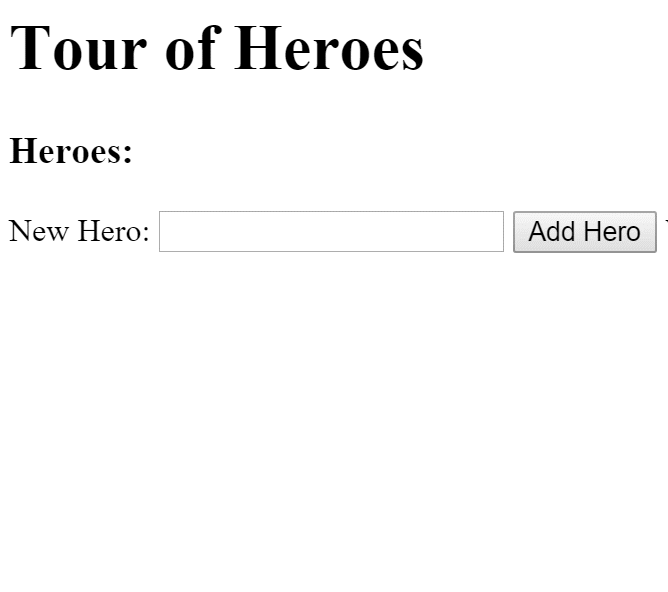

> Angular2 Document > DOCS > Advanced 한글 번역본
> 2016/11월 기준 으로 작성 되었고, 의역 하였고, 오역이 있을 수 있습니다.

HTTP Client
----

HTTP 클라이언트를 사용하여 원격 서버와 통신하십시오.

HTTP는 브라우저/서버 통신을 위한 기본 프로토콜 입니다.

> WebSocket 프로토콜은 또 다른 중요한 통신 기술입니다. 이 페이지 에서는 다루지 않습니다.

최신 브라우저는 두 개의 HTTP 기반 API 인 XMLHttpRequest (XHR)와 JSONP를 지원합니다. 일부 브라우저는 가져 오기도 지원합니다.

Angular HTTP 라이브러리는 XHR 및 JSONP API를 사용한 응용 프로그래밍을 단순화합니다. 이 페이지는 다음 내용을 다룹니다.

- Tour of Heroes HTTP 클라이언트 데모.
- http.get로 데이터를 가져옵니다.
- RxJS 라이브러리.
- RxJS 운영자를 활성화합니다.
- 응답 객체를 처리합니다.
- 항상 오류를 처리하십시오.
- 서버에 데이터를 보냅니다.
- 약속으로 넘어지지.
- Cross-Origin Requests : 위키피디아 예제.
	- 검색 매개 변수.
	- 관측 대상에 대한 재미.
- 교차 사이트 요청 위조 방지
- 부록 : 히어로 인 메모리 서버 둘러보기.

실제 예가 이러한 주제를 설명 합니다.

A [live example](https://angular.io/resources/live-examples/server-communication/ts/plnkr.html) illustrates these topics.

# Demos

이 페이지에서는 다음과 같은 데모를 통해 서버 통신에 대해 설명합니다.

- Tour of Heroes HTTP 클라이언트 데모.
- Promises의 Fall back
- Cross-Origin Requests : 위키피디아 예제.
- 재밌는 observables

아래의 데모는 Root `AppComponent`를 조정 하는 예제 이다.

**[app/app.component.ts]**
```typescript
import { Component }         from '@angular/core';
// Add the RxJS Observable operators.
import './rxjs-operators';
@Component({
  selector: 'my-app',
  template: `
    <hero-list></hero-list>
    <hero-list-promise></hero-list-promise>
    <my-wiki></my-wiki>
    <my-wiki-smart></my-wiki-smart>
  `
})
export class AppComponent { }
```

나중에 설명할 RxJS 연산자 가져 오기를 제외 하고는 주목할 만한 점이 없습니다.

```typescript
// Add the RxJS Observable operators.
import './rxjs-operators';
```

# Providing HTTP services

먼저 서버 통신 기능을 사용하도록 응용 프로그램을 구성합니다.

Angular Http 클라이언트는 친숙한 HTTP 요청/응답 프로토콜을 사용 하여 서버와 통신 합니다. Http 클라이언트는 Angular HTTP 라이브러리의 서비스 패밀리 중 하나 입니다.

> @angular / http 모듈에서 가져 오는 경우 systemjs.config.js 파일이 해당 모듈 이름에 매핑 되기 때문에 SystemJS 는 Angular HTTP 라이브러리에서 서비스를 로드하는 방법을 알고 있습니다.

Http 클라이언트를 사용하려면 먼저 종속성 주입 시스템을 사용 하여 서비스 공급자로 등록 해야 합니다.

> Dependency Injection 페이지 에서 공급자에 대해 읽어 보십시오.

app.module.ts의 루트 NgModule 에 다른 NgModule 을 가져 와서 공급자를 등록 하십시오.

**[app/app.module.ts (v1)}**

```typescript
import { NgModule } from '@angular/core';
import { BrowserModule } from '@angular/platform-browser';
import { FormsModule } from '@angular/forms';
import { HttpModule, JsonpModule } from '@angular/http';

import { AppComponent } from './app.component';

@NgModule({
  imports: [
    BrowserModule,
    FormsModule,
    HttpModule,
    JsonpModule
  ],
  declarations: [ AppComponent ],
  bootstrap:    [ AppComponent ]
})
export class AppModule { }
```

필요한 구성원을 import 하십시오. 신규 사용자는 Angular HTTP  라이브러리의 `HttpModule` 및 `JsonpModule` 입니다. 가져 오기 및 관련 용어에 대한 자세한 내용은 import 문에서 MDN 참조를 참조하십시오.

이러한 모듈을 응용 프로그램에 추가하려면 루트 @NgModule의 가져 오기 배열로 전달합니다.

> HTTP 호출을 하려면 HttpModule 이 필요합니다. JsonpModule은 일반 HTTP 에는 필요하지 않지만 나중에 이 페이지에 JSONP 데모가 있습니다. 
모듈을 로드 하면 시간이 절약 됩니다.

# Tour of Heroes HTTP 클라이언트 데모

첫 번째 데모는 자습서의 "Tour of Heroes" 애플리케이션의 미니 버전 입니다. 이 버전은 서버 에서 Heroes를 얻은 다음 목록에 표시하고 사용자가 새로운 hero를 추가 하고 서버에 저장 합니다. 
앱은 Angular Http 클라이언트를 사용 하여 XMLHttpRequest (XHR) 를 통해 통신 합니다.

이것은 다음과 같이 작동한다.


이 데모 에는 `HeroListComponent` 라는 단일 Component 가 있다. 템플릿은 다음과 같다.

**[app/toh/hero-list.component.html (template)]**

```typescript
<h1>Tour of Heroes ({{mode}})</h1>
<h3>Heroes:</h3>
<ul>
  <li *ngFor="let hero of heroes">{{hero.name}}</li>
</ul>
<label>New hero name: <input #newHeroName /></label>
<button (click)="addHero(newHeroName.value); newHeroName.value=''">Add Hero</button>
<p class="error" *ngIf="errorMessage">{{errorMessage}}</p>
```

그것은 hero 의 명단을 ngFor 를 이용 해서 표현 한다. 목록 아래 에는 입력 상자와 hero 추가 버튼이 있다. 
여기에서 새로운 hero의 이름을 입력하고, 데이터베이스에 추가 할 수 있다.
 
template 참조 변수인 newHeroName 은 (click) 이벤트 바인딩 에서 입력 상자의 값에 액세스 합니다. 
사용자가 버튼을 클릭 하면 해당 값이 구성 요소의 `addHero` 메서드로 전달 된 다음 이벤트 바인딩 이이를 지워 새로운 hero 이름을 준비 합니다.

버튼 아래에는 오류 메시지 영역이 있습니다.

# The HeroListComponent class

**[app/toh/hero-list.component.ts (class)]**

```typescript
export class HeroListComponent implements OnInit {
  errorMessage: string;
  heroes: Hero[];
  mode = 'Observable';
  constructor (private heroService: HeroService) {}
  ngOnInit() { this.getHeroes(); }
  getHeroes() {
    this.heroService.getHeroes()
                     .subscribe(
                       heroes => this.heroes = heroes,
                       error =>  this.errorMessage = <any>error);
  }
  addHero (name: string) {
    if (!name) { return; }
    this.heroService.addHero(name)
                     .subscribe(
                       hero  => this.heroes.push(hero),
                       error =>  this.errorMessage = <any>error);
  }
}
```

Angular는 HeroService를 생성자에 삽입 하고 해당 구성 요소는 데이터를 가져와 저장하기 위해 서비스를 호출 합니다.

이 Component 는 Angular Http 클라이언트와 직접 대화 하지 않습니다. 
Component 는 데이터를 얻는 방법을 알지 못하거나 신경을 쓰지 않습니다. HeroService 에 위임합니다.

데이터 액세스를 항상 지원하는 서비스 클래스에 위임합니다.

런타임에 Component 가 작성 직후 hero을 요청 하더라도 Component 의 생성자 에서 서비스의 get 메소드를 호출 하지 않습니다. 
대신 ngOnInit 라이프 사이클 후크 내에서 호출 하고, 이 Component를 인스턴스화 할 때 Angular를 사용 하여 ngOnInit 을 호출 하십시오.

> 이것은 최선의 방법 입니다. 구성 요소가 단순하고 모든 실제 작업 (특히 원격 서버 호출)이 별도의 방법 으로 처리되는 경우 구성 요소는 테스트 및 디버그가 쉬워집니다.

서비스의 `getHeroes()` 및 `addHero()` 메서드는 Angular Http 클라이언트가 서버 에서 가져온 Observable of hero data를 반환합니다.

Observable을 어떤 출처에서 게시 한 이벤트 스트림으로 생각하십시오. 

이 스트림에서 이벤트를 수신하려면 Observable 에 가입 하십시오. 

이러한 구독은 웹 요청이 성공 이벤트 (이벤트 페이로드의 영웅 데이터 포함) 또는 실패 이벤트 (페이로드 오류 포함)를 생성 할 때 수행 할 작업을 지정 합니다.

구성 요소를 기본적으로 이해하면 `HeroService` 내부를 볼 준비가 된 것입니다.

# Fetch data with http.get

이전 샘플의 대부분 에서 이 앱은 가상 hero를 다음과 같은 서비스에 반환 하여 서버 와의 상호 작용을 위장 했습니다.

```typescript
import { Injectable } from '@angular/core';

import { Hero } from './hero';
import { HEROES } from './mock-heroes';

@Injectable()
export class HeroService {
  getHeroes(): Promise<Hero[]> {
    return Promise.resolve(HEROES);
  }
}
```

Angular Http 클라이언트 서비스를 사용하여 HeroService를 수정하여 서버에서 영웅을 얻을 수 있습니다.

**[app/toh/hero.service.ts (revised)]**

```typescript
import { Injectable }     from '@angular/core';
import { Http, Response } from '@angular/http';
import { Hero }           from './hero';
import { Observable }     from 'rxjs/Observable';
@Injectable()
export class HeroService {
  private heroesUrl = 'app/heroes';  // URL to web API
  constructor (private http: Http) {}
  getHeroes (): Observable<Hero[]> {
    return this.http.get(this.heroesUrl)
                    .map(this.extractData)
                    .catch(this.handleError);
  }
  private extractData(res: Response) {
    let body = res.json();
    return body.data || { };
  }
  private handleError (error: Response | any) {
    // In a real world app, we might use a remote logging infrastructure
    let errMsg: string;
    if (error instanceof Response) {
      const body = error.json() || '';
      const err = body.error || JSON.stringify(body);
      errMsg = `${error.status} - ${error.statusText || ''} ${err}`;
    } else {
      errMsg = error.message ? error.message : error.toString();
    }
    console.error(errMsg);
    return Observable.throw(errMsg);
  }
}
```

Angular Http 클라이언트 서비스가 HeroService 생성자에 삽입됩니다.

```typescript
constructor (private http: Http) {}
```

http.get을 호출하는 방법을 자세히 살펴 보십시오.

**[app/toh/hero.service.ts (getHeroes)]**

```typescript
getHeroes (): Observable<Hero[]> {
  return this.http.get(this.heroesUrl)
                  .map(this.extractData)
                  .catch(this.handleError);
}
```

얻을 URL 리소스 URL을 전달하고 hero를 반환하는 서버를 호출 합니다.

> 서버는 아래 부록에서 설명한 인 메모리 웹 API를 설정하면 영웅을 반환합니다. 또는 엔드 포인트 URL을 변경하여 일시적으로 JSON 파일을 대상으로 지정할 수 있습니다.
> 
```typescript
private heroesUrl = 'app/heroes.json'; // URL to JSON file
```

최신 자바 스크립트에서 비동기 메소드에 익숙하다면, get 메소드가 약속을 되 돌리는 것을 기대할 수있다. then ()에 대한 호출을 연결하고 영웅을 추출해야합니다. 대신 map () 메서드를 호출하고 있습니다. 분명히 이것은 약속이 아닙니다.

사실 http.get 메소드는 RxJS 라이브러리에서 Observable of HTTP Responses (Observable <Response>)를 반환하고 map은 RxJS 연산자 중 하나입니다.

# RxJS library

RxJS ( "Reactive Extensions")는 비동기 관찰 패턴을 구현하는 Angular가 보증하는 타사 라이브러리입니다.

observables는 Angular 어플리케이션에서 널리 사용되기 때문에 모든 Developer Guide 샘플은 RxJS npm 패키지를 설치하고 system.js를 통해로드했습니다.

HTTP 클라이언트로 작업 할 때 응용 프로그램에 필요합니다. 또한 RxJS observables를 사용할 수있게하려면 중요한 추가 단계를 수행 해야합니다.

### Enable RxJS operators

RxJS 라이브러리는 큽니다. 프로덕션 응용 프로그램을 빌드하고 모바일 장치에 배포 할 때 크기가 중요합니다. 필요한 기능 만 포함시켜야합니다.

따라서 Angular는 rxjs / Observable 모듈에서 Observable을 제거한 버전을 제공합니다.이 모듈은 위에서 getHeroes에서 호출 한 map 메소드와 같은 연산자가 대부분을 지원하지 않습니다.

필요한 연산자를 추가 하는 것은 개발자의 몫 입니다.

하나의 import 문으로 모든 RxJS 연산자를 추가 할 수 있습니다. 이것이 가장 쉬운 방법이지만 전체 라이브러리가 너무 크기 때문에 실행 시간과 응용 프로그램 크기를 늘려야 합니다.

이 응용 프로그램은 소수의 연산자 만 사용하기 때문에 각 Observable 연산자와 정적 클래스 메서드를 하나씩 가져 와서 응용 프로그램 요구 사항에 맞게 조정 된 사용자 지정 Observable 구현을 가져 오는 것이 좋습니다. 하나의 app / rxjs-operators.ts 파일에 import 문을 넣으십시오.

**[app/rxjs-operators.ts]**

```typescript
// import 'rxjs/Rx'; // adds ALL RxJS statics & operators to Observable

// See node_module/rxjs/Rxjs.js
// Import just the rxjs statics and operators needed for THIS app.

// Statics
import 'rxjs/add/observable/throw';

// Operators
import 'rxjs/add/operator/catch';
import 'rxjs/add/operator/debounceTime';
import 'rxjs/add/operator/distinctUntilChanged';
import 'rxjs/add/operator/map';
import 'rxjs/add/operator/switchMap';
import 'rxjs/add/operator/toPromise';
```

연산자를 잊어 버린 경우 TypeScript 컴파일러가 누락되었음을 경고하고이 파일을 업데이트합니다.

> 앱은 HeroService에서 이러한 특정 연산자를 모두 필요로하지 않습니다.지도, catch 및 Throw뿐입니다. 다른 연산자는 나중에 위키 예제에서 볼 수 있습니다.

마지막으로 rxjs-operator를 app.component.ts로 가져 옵니다.

**[app/app.component.ts (import rxjs)]**

```typescript
// Add the RxJS Observable operators.
import './rxjs-operators';
```

이제 HeroService로 돌아가려면 다음 섹션으로 계속 진행하십시오.

## Process the response object

`getHeroes()` 메서드는 extractData 헬퍼 메서드를 사용하여 http.get 응답 객체를 영웅에게 매핑 합니다.

**[app/toh/hero.service.ts (excerpt)]**

```typescript
private extractData(res: Response) {
  let body = res.json();
  return body.data || { };
}
```

응답 객체는 앱이 직접 사용할 수있는 형태로 데이터를 보유하지 않습니다. 응답 데이터를 JSON 객체로 파싱 해야 합니다.

### Parse to JSON

응답 데이터는 JSON 문자열 형식입니다. 앱은 `response.json()` 을 호출하여 해당 문자열을 JavaScript 객체로 파싱해야합니다.

> 이것은 Angular 자신의 디자인이 아닙니다. Angular HTTP 클라이언트는 Fetch 함수에 의해 반환 된 응답 개체에 대한 Fetch 사양을 따릅니다. 이 스펙은 응답 본문을 JavaScript 객체로 구문 분석하는 json () 메서드를 정의합니다.

> 해독 된 JSON이 영웅의 배열이 될 것이라고 기대하지 마십시오. 이 서버는 JSON 결과를 데이터 속성이있는 객체로 항상 래핑합니다. 영웅을 얻으려면 그것을 풀어야합니다. 이는 보안 문제로 인해 발생하는 일반적인 웹 API 동작입니다.

> 서버 API에 대한 어떠한 가정도하지 마십시오. 모든 서버가 데이터 속성이있는 객체를 반환하지는 않습니다.

### 응답 객체를 반환하지 않습니다.

getHeroes () 메서드는 HTTP 응답을 반환 할 수 있었지만 이것이 최선의 방법은 아닙니다. 데이터 서비스의 요점은 서버 상호 작용 세부 사항을 소비자로부터 숨기는 것입니다. HeroService를 호출하는 구성 요소는 히어로 만 필요로하고 영웅을 얻는 것과는 별도로 유지되며 코드를 가져 오는 코드와 응답 객체를 구분 합니다.

> ####HTTP GET 지연
> http.get은 요청을 아직 보내지 않습니다. 이 관측 가능 함은 추위입니다. 즉, 관측 대상에 가입 할 때까지 요청이 전달되지 않습니다. 그게 HeroListComponent입니다.

### Always handle errors

I/O를 처리하는 데있어 중요한 부분은 오류를 예상하여 오류를 잡으려고 준비하고 오류를 처리하는 것입니다. 오류를 처리하는 한 가지 방법은 오류 메시지를 사용자에게 표시하기 위해 구성 요소로 다시 전달하는 것입니다. 단, 사용자가 이해하고 조치 할 수있는 내용만 표시 해야 합니다.

이 간단한 응용 프로그램은 getHeroes 오류를 처리하는 방식으로 불완전하지만 그 아이디어를 전달합니다.

**[app/toh/hero.service.ts (excerpt)]**

```typescript
getHeroes (): Observable<Hero[]> {
  return this.http.get(this.heroesUrl)
                  .map(this.extractData)
                  .catch(this.handleError);
}

private handleError (error: Response | any) {
  // In a real world app, we might use a remote logging infrastructure
  let errMsg: string;
  if (error instanceof Response) {
    const body = error.json() || '';
    const err = body.error || JSON.stringify(body);
    errMsg = `${error.status} - ${error.statusText || ''} ${err}`;
  } else {
    errMsg = error.message ? error.message : error.toString();
  }
  console.error(errMsg);
  return Observable.throw(errMsg);
}
```

The catch operator passes the error object from http to the handleError method. The handleError method transforms the error into a developer-friendly message, logs it to the console, and returns the message in a new, failed observable via Observable.throw.

### HeroListComponent error handling
Back in the HeroListComponent, in heroService.getHeroes(), the subscribe function has a second function parameter to handle the error message. It sets an errorMessage variable that's bound conditionally in the HeroListComponent template.

app/toh/hero-list.component.ts (getHeroes)
COPY CODE
getHeroes() {
  this.heroService.getHeroes()
                   .subscribe(
                     heroes => this.heroes = heroes,
                     error =>  this.errorMessage = <any>error);
}
Want to see it fail? In the HeroService, reset the api endpoint to a bad value. Afterward, remember to restore it.
Send data to the server

So far you've seen how to retrieve data from a remote location using an HTTP service. Now you'll add the ability to create new heroes and save them in the backend.

You'll write a method for the HeroListComponent to call, an addHero() method, that takes just the name of a new hero and returns an Observable of Hero. It begins like this:

COPY CODE
addHero (name: string): Observable<Hero> {
To implement it, you must know the server's API for creating heroes.

This sample's data server follows typical REST guidelines. It expects a POST request at the same endpoint as GET heroes. It expects the new hero data to arrive in the body of the request, structured like a Hero entity but without the id property. The body of the request should look like this:

COPY CODE
{ "name": "Windstorm" }
The server generates the id and returns the entire JSON representation of the new hero including its generated id. The hero arrives tucked inside a response object with its own data property.

Now that you know how the API works, implement addHero()as follows:

app/toh/hero.service.ts (additional imports)
COPY CODE
import { Headers, RequestOptions } from '@angular/http';
app/toh/hero.service.ts (addHero)
COPY CODE
  addHero (name: string): Observable<Hero> {
    let headers = new Headers({ 'Content-Type': 'application/json' });
    let options = new RequestOptions({ headers: headers });

    return this.http.post(this.heroesUrl, { name }, options)
                    .map(this.extractData)
                    .catch(this.handleError);
  }
Headers
In the headers object, the Content-Type specifies that the body represents JSON.

Next, the headers object is used to configure the options object. The options object is a new instance of RequestOptions, a class that allows you to specify certain settings when instantiating a request. In this way, headers is one of the RequestOptions.

In the return statement, options is the third argument of the post method, as shown above.

JSON results
As with getHeroes(), use the extractData() helper to extract the data from the response.

Back in the HeroListComponent, its addHero() method subscribes to the observable returned by the service's addHero() method. When the data arrive it pushes the new hero object into its heroes array for presentation to the user.

app/toh/hero-list.component.ts (addHero)
COPY CODE
addHero (name: string) {
  if (!name) { return; }
  this.heroService.addHero(name)
                   .subscribe(
                     hero  => this.heroes.push(hero),
                     error =>  this.errorMessage = <any>error);
}
Fall back to promises

Although the Angular http client API returns an Observable<Response> you can turn it into a Promise<Response>. It's easy to do, and in simple cases, a promise-based version looks much like the observable-based version.

While promises may be more familiar, observables have many advantages.
Here is a comparison of the HeroService using promises versus observables, highlighting just the parts that are different.

app/toh/hero.service.promise.ts (promise-based) app/toh/hero.service.ts (observable-based)
COPY CODE
getHeroes (): Promise<Hero[]> {
  return this.http.get(this.heroesUrl)
                  .toPromise()
                  .then(this.extractData)
                  .catch(this.handleError);
}
addHero (name: string): Promise<Hero> {
  let headers = new Headers({ 'Content-Type': 'application/json' });
  let options = new RequestOptions({ headers: headers });
  return this.http.post(this.heroesUrl, { name }, options)
             .toPromise()
             .then(this.extractData)
             .catch(this.handleError);
}
private extractData(res: Response) {
  let body = res.json();
  return body.data || { };
}
private handleError (error: Response | any) {
  // In a real world app, we might use a remote logging infrastructure
  let errMsg: string;
  if (error instanceof Response) {
    const body = error.json() || '';
    const err = body.error || JSON.stringify(body);
    errMsg = `${error.status} - ${error.statusText || ''} ${err}`;
  } else {
    errMsg = error.message ? error.message : error.toString();
  }
  console.error(errMsg);
  return Promise.reject(errMsg);
}
You can follow the promise then(this.extractData).catch(this.handleError) pattern as in this example.

Alternatively, you can call toPromise(success, fail). The observable's map callback moves to the first success parameter and its catch callback to the second fail parameter in this pattern: .toPromise(this.extractData, this.handleError).

The errorHandler forwards an error message as a failed promise instead of a failed observable.

The diagnostic log to console is just one more then in the promise chain.

You have to adjust the calling component to expect a Promise instead of an observable:

app/toh/hero-list.component.promise.ts (promise-based) app/toh/hero-list.component.ts (observable-based)
COPY CODE
getHeroes() {
  this.heroService.getHeroes()
                   .then(
                     heroes => this.heroes = heroes,
                     error =>  this.errorMessage = <any>error);
}
addHero (name: string) {
  if (!name) { return; }
  this.heroService.addHero(name)
                   .then(
                     hero  => this.heroes.push(hero),
                     error =>  this.errorMessage = <any>error);
}
The only obvious difference is that you call then on the returned promise instead of subscribe. Both methods take the same functional arguments.

The less obvious but critical difference is that these two methods return very different results.

The promise-based then returns another promise. You can keep chaining more then and catch calls, getting a new promise each time.

The subscribe method returns a Subscription. A Subscription is not another Observable. It's the end of the line for observables. You can't call map on it or call subscribe again. The Subscription object has a different purpose, signified by its primary method, unsubscribe.

To understand the implications and consequences of subscriptions, watch Ben Lesh's talk on observables or his video course on egghead.io.
Cross-Origin Requests: Wikipedia example

You just learned how to make XMLHttpRequests using the Angular Http service. This is the most common approach for server communication, but it doesn't work in all scenarios.

For security reasons, web browsers block XHR calls to a remote server whose origin is different from the origin of the web page. The origin is the combination of URI scheme, hostname, and port number. This is called the same-origin policy.

Modern browsers do allow XHR requests to servers from a different origin if the server supports the CORS protocol. If the server requires user credentials, you'll enable them in the request headers.
Some servers do not support CORS but do support an older, read-only alternative called JSONP. Wikipedia is one such server.

This Stack Overflow answer covers many details of JSONP.
Search wikipedia
Here is a simple search that shows suggestions from Wikipedia as the user types in a text box:

Wikipedia search app (v.1)
Wikipedia offers a modern CORS API and a legacy JSONP search API. This example uses the latter. The Angular Jsonp service both extends the Http service for JSONP and restricts you to GET requests. All other HTTP methods throw an error because JSONP is a read-only facility.

As always, wrap the interaction with an Angular data access client service inside a dedicated service, here called WikipediaService.

app/wiki/wikipedia.service.ts
COPY CODE
import { Injectable } from '@angular/core';
import { Jsonp, URLSearchParams } from '@angular/http';
@Injectable()
export class WikipediaService {
  constructor(private jsonp: Jsonp) {}
  search (term: string) {
    let wikiUrl = 'http://en.wikipedia.org/w/api.php';
    let params = new URLSearchParams();
    params.set('search', term); // the user's search value
    params.set('action', 'opensearch');
    params.set('format', 'json');
    params.set('callback', 'JSONP_CALLBACK');
    // TODO: Add error handling
    return this.jsonp
               .get(wikiUrl, { search: params })
               .map(response => <string[]> response.json()[1]);
  }
}
The constructor expects Angular to inject its jsonp service, which is available because JsonpModule is in the root @NgModule imports array in app.module.ts.

Search parameters
The Wikipedia "opensearch" API expects four parameters (key/value pairs) to arrive in the request URL's query string. The keys are search, action, format, and callback. The value of the search key is the user-supplied search term to find in Wikipedia. The other three are the fixed values "opensearch", "json", and "JSONP_CALLBACK" respectively.

The JSONP technique requires that you pass a callback function name to the server in the query string: callback=JSONP_CALLBACK. The server uses that name to build a JavaScript wrapper function in its response, which Angular ultimately calls to extract the data. All of this happens under the hood.
If you're looking for articles with the word "Angular", you could construct the query string by hand and call jsonp like this:

COPY CODE
let queryString =
  `?search=${term}&action=opensearch&format=json&callback=JSONP_CALLBACK`;

return this.jsonp
           .get(wikiUrl + queryString)
           .map(response => <string[]> response.json()[1]);
In more parameterized examples you could build the query string with the Angular URLSearchParams helper:

app/wiki/wikipedia.service.ts (search parameters)
COPY CODE
let params = new URLSearchParams();
params.set('search', term); // the user's search value
params.set('action', 'opensearch');
params.set('format', 'json');
params.set('callback', 'JSONP_CALLBACK');
This time you call jsonp with two arguments: the wikiUrl and an options object whose search property is the params object.

app/wiki/wikipedia.service.ts (call jsonp)
COPY CODE
// TODO: Add error handling
return this.jsonp
           .get(wikiUrl, { search: params })
           .map(response => <string[]> response.json()[1]);
Jsonp flattens the params object into the same query string you saw earlier, putting the request on the wire.

The WikiComponent
Now that you have a service that can query the Wikipedia API turn to the component (template and class) that takes user input and displays search results.

app/wiki/wiki.component.html
COPY CODE
<h1>{{title}}</h1>
<p><i>{{fetches}}</i></p>
<input #term (keyup)="search(term.value)"/>
<ul>
  <li *ngFor="let item of items | async">{{item}}</li>
</ul>
app/wiki/wiki.component.ts
COPY CODE
import { Component }        from '@angular/core';
import { Observable }       from 'rxjs/Observable';
import { WikipediaService } from './wikipedia.service';
@Component({
  moduleId: module.id,
  selector: 'my-wiki',
  templateUrl: 'wiki.component.html',
  providers: [ WikipediaService ]
})
export class WikiComponent {
  title   = 'Wikipedia Demo';
  fetches = 'Fetches after each keystroke';
  items: Observable<string[]>;
  search (term: string) {
    this.items = this.wikipediaService.search(term);
  }
  constructor (private wikipediaService: WikipediaService) { }
}
The template presents an <input> element search box to gather search terms from the user, and calls a search(term) method after each keyup event.

wiki/wiki.component.html
COPY CODE
<input #term (keyup)="search(term.value)"/>
The component's search(term) method delegates to the WikipediaService, which returns an observable array of string results (Observable<string[]>). Instead of subscribing to the observable inside the component, as in the HeroListComponent, the app forwards the observable result to the template (via items) where the async pipe in the ngFor handles the subscription. Read more about async pipes in the Pipes page.

The async pipe is a good choice in read-only components where the component has no need to interact with the data.

HeroListComponent can't use the pipe because addHero() pushes newly created heroes into the list.
A wasteful app

The wikipedia search makes too many calls to the server. It is inefficient, and potentially expensive on mobile devices with limited data plans.

1. Wait for the user to stop typing
Presently, the code calls the server after every key stroke. It should only make requests when the user stops typing . Here's how it will work after refactoring:

Wikipedia search app (v.2)
2. Search when the search term changes
Suppose a user enters the word angular in the search box and pauses for a while. The application issues a search request for angular.

Then the user backspaces over the last three letters, lar, and immediately re-types lar before pausing once more. The search term is still angular. The app shouldn't make another request.

3. Cope with out-of-order responses
The user enters angular, pauses, clears the search box, and enters http. The application issues two search requests, one for angular and one for http.

Which response arrives first? It's unpredictable. A load balancer could dispatch the requests to two different servers with different response times. The results from the first angular request might arrive after the later http results. The user will be confused if the angular results display to the http query.

When there are multiple requests in-flight, the app should present the responses in the original request order. That won't happen if angular results arrive last.


More fun with observables

You can address these problems and improve the app with the help of some nifty observable operators.

You could make changes to the WikipediaService, but for a better user experience, create a copy of the WikiComponent instead and make it smarter. Here's the WikiSmartComponent which uses the same template.

app/wiki/wiki-smart.component.ts
COPY CODE
import { Component }        from '@angular/core';
import { Observable }       from 'rxjs/Observable';
import { Subject }          from 'rxjs/Subject';
import { WikipediaService } from './wikipedia.service';
@Component({
  moduleId: module.id,
  selector: 'my-wiki-smart',
  templateUrl: 'wiki.component.html',
  providers: [ WikipediaService ]
})
export class WikiSmartComponent {
  title   = 'Smarter Wikipedia Demo';
  fetches = 'Fetches when typing stops';
  items: Observable<string[]>;
  private searchTermStream = new Subject<string>();
  search(term: string) { this.searchTermStream.next(term); }
  constructor (private wikipediaService: WikipediaService) {
    this.items = this.searchTermStream
      .debounceTime(300)
      .distinctUntilChanged()
      .switchMap((term: string) => this.wikipediaService.search(term));
  }
}
Create a stream of search terms
The template still binds to the search box keyup event and passes the complete search box value into the component's search method after every user keystroke.

app/wiki/wiki.component.html (input)
COPY CODE
<input #term (keyup)="search(term.value)"/>
The WikiSmartComponent turns the search box values into an observable stream of search terms with the help of a Subject which you import from the RxJS observable library:

app/wiki/wiki-smart.component.ts
COPY CODE
import { Subject }          from 'rxjs/Subject';
The component creates a searchTermStream as a Subject of type string. The search method adds each new search box value to that stream via the subject's next method.

app/wiki/wiki-smart.component.ts
COPY CODE
private searchTermStream = new Subject<string>();
search(term: string) { this.searchTermStream.next(term); }
Listen for search terms
Earlier, you passed each search term directly to the service and bound the template to the service results.

Now you listen to the stream of search terms, manipulating the stream before it reaches the WikipediaService.

app/wiki/wiki-smart.component.ts
COPY CODE
this.items = this.searchTermStream
  .debounceTime(300)
  .distinctUntilChanged()
  .switchMap((term: string) => this.wikipediaService.search(term));
Wait for the user to stop typing for at least 300 milliseconds (debounceTime). Only changed search values make it through to the service (distinctUntilChanged).

The WikipediaService returns a separate observable of string arrays (Observable<string[]>) for each request. There could be multiple requests in-flight, all awaiting the server's reply, which means multiple observables-of-strings could arrive at any moment in any order.

The switchMap (formerly known as flatMapLatest) returns a new observable that combines these WikipediaService observables, re-arranges them in their original request order, and delivers to subscribers only the most recent search results.

The displayed list of search results stays in sync with the user's sequence of search terms.

You added the debounceTime, distinctUntilChanged, and switchMap operators to the RxJS Observable class in rxjs-operators as described above.
Guarding against Cross-Site Request Forgery

In a cross-site request forgery (CSRF or XSRF), an attacker tricks the user into visiting a different web page with malignant code that secretly sends a malicious request to your application's web server,

The server and client application must work together to thwart this attack. Angular's Http client does its part by applying a default CookieXSRFStrategy automatically to all requests.

The CookieXSRFStrategy supports a common anti-XSRF technique in which the server sends a randomly generated authentication token in a cookie named XSRF-TOKEN. The HTTP client adds an X-XSRF-TOKEN header with that token value to subsequent requests. The server receives both the cookie and the header, compares them, and processes the request only if the cookie and header match.

See the XSRF topic on the Security page for more information about XSRF and Angular's XSRFStrategy counter measures.

Appendix: Tour of Heroes in-memory server

If the app only needed to retrieve data, you could get the heroes from a heroes.json file:

app/heroes.json
COPY CODE
{
  "data": [
    { "id": 1, "name": "Windstorm" },
    { "id": 2, "name": "Bombasto" },
    { "id": 3, "name": "Magneta" },
    { "id": 4, "name": "Tornado" }
  ]
}
You wrap the heroes array in an object with a data property for the same reason that a data server does: to mitigate the security risk posed by top-level JSON arrays.
You'd set the endpoint to the JSON file like this:

app/toh/hero.service.ts
COPY CODE
private heroesUrl = 'app/heroes.json'; // URL to JSON file
The get heroes scenario would work, but since the app can't save changes to a JSON file, it needs a web API server. Because there isn't a real server for this demo, it uses an in-memory web API simulator instead.

The in-memory web api is not part of the Angular core. It's an optional service in its own angular-in-memory-web-api library installed with npm (see package.json) and registered for module loading by SystemJS (see systemjs.config.js).
The in-memory web API gets its data from a custom application class with a createDb() method that returns a map whose keys are collection names and whose values are arrays of objects in those collections.

Here's the class for this sample, based on the JSON data:

app/hero-data.ts
COPY CODE
import { InMemoryDbService } from 'angular-in-memory-web-api';
export class HeroData implements InMemoryDbService {
  createDb() {
    let heroes = [
      { id: 1, name: 'Windstorm' },
      { id: 2, name: 'Bombasto' },
      { id: 3, name: 'Magneta' },
      { id: 4, name: 'Tornado' }
    ];
    return {heroes};
  }
}
Ensure that the HeroService endpoint refers to the web API:

app/toh/hero.service.ts
COPY CODE
private heroesUrl = 'app/heroes';  // URL to web API
Finally, redirect client HTTP requests to the in-memory web API by adding the InMemoryWebApiModule to the AppModule.imports list. At the same time, call its forRoot configuration method with the HeroData class.

app/app.module.ts
COPY CODE
InMemoryWebApiModule.forRoot(HeroData)
How it works
Angular's http service delegates the client/server communication tasks to a helper service called the XHRBackend.

Using standard Angular provider registration techniques, the InMemoryWebApiModule replaces the default XHRBackend service with its own in-memory alternative. At the same time, the forRoot method initializes the in-memory web API with the seed data from the mock hero dataset.

The forRoot method name is a strong reminder that you should only call the InMemoryWebApiModule once, while setting the metadata for the root AppModule. Don't call it again.
Here is the final, revised version of app/app.module.ts, demonstrating these steps.

app/app.module.ts (excerpt)
COPY CODE
import { NgModule } from '@angular/core';
import { BrowserModule } from '@angular/platform-browser';
import { FormsModule } from '@angular/forms';
import { HttpModule, JsonpModule }  from '@angular/http';

import { InMemoryWebApiModule }     from 'angular-in-memory-web-api';
import { HeroData }                 from './hero-data';

import { AppComponent }             from './app.component';

import { HeroListComponent }        from './toh/hero-list.component';
import { HeroListPromiseComponent } from './toh/hero-list.component.promise';

import { WikiComponent }      from './wiki/wiki.component';
import { WikiSmartComponent } from './wiki/wiki-smart.component';

@NgModule({
  imports: [
    BrowserModule,
    FormsModule,
    HttpModule,
    JsonpModule,
    InMemoryWebApiModule.forRoot(HeroData)
  ],
  declarations: [
    AppComponent,
    HeroListComponent,
    HeroListPromiseComponent,
    WikiComponent,
    WikiSmartComponent
  ],
  bootstrap: [ AppComponent ]
})
export class AppModule { }
Import the InMemoryWebApiModule after the HttpModule to ensure that the XHRBackend provider of the InMemoryWebApiModule supersedes all others.

See the full source code in the live example.


